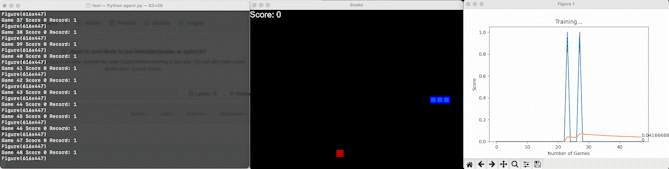

# Snake Game #

Applied Q-learning


# Snake_Game_with_AI

- Apllied GPU/CPU version
- Memory storage and batch sized is balanced
- Snake moves randomly
- Applied Manhattan distance 

```

self._move(action) # update the head
self.snake.insert(0, self.head)
# Calculate Manhattan distance between snake head and food
distance_to_food = abs(self.head.x - self.food.x) + abs(self.head.y - self.food.y)

```




***References***

https://www.youtube.com/watch?v=L8ypSXwyBds

